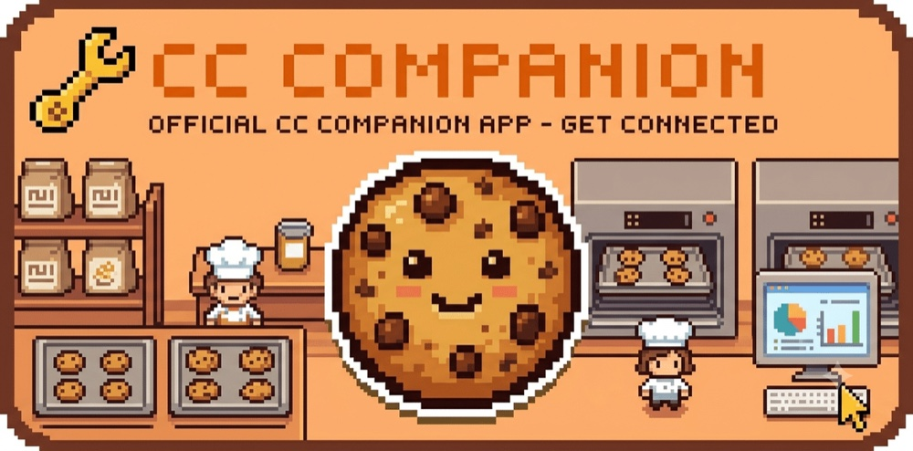
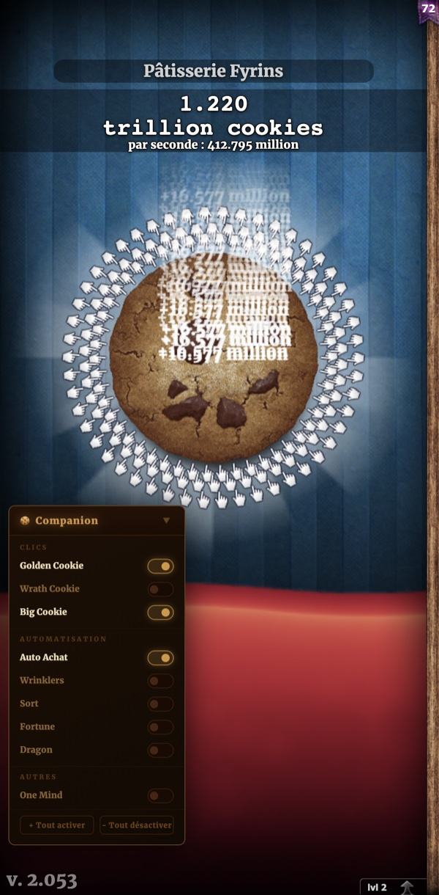
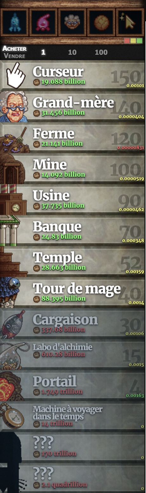
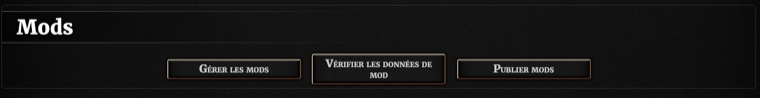
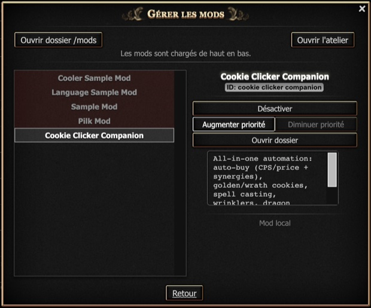

  

# Cookie Clicker Companion

All-in-one automation mod for Cookie Clicker (Steam / PC). Automates repetitive tasks without touching progression values — achievements remain unaffected.

  

## Features

| Feature | Description |
|---|---|
| **Golden Cookie** | Auto-clicks golden cookies and reindeer as soon as they appear |
| **Wrath Cookie** | Auto-clicks wrath cookies (red) — enable with caution during Grandmapocalypse |
| **Big Cookie** | Continuously clicks the main cookie at max speed |
| **Auto Buy** | Purchases the most profitable building using CPS/price ratio + synergy bonuses |
| **Wrinklers** | Pops all wrinklers once they all reach final stage, collecting their cookies |
| **Spell** | Casts Force the Hand of Fate automatically when the Grimoire is fully charged |
| **Fortune** | Clicks fortune messages in the news ticker to collect rewards |
| **Dragon** | Levels up Krumblor automatically when resources allow |
| **One Mind** | Allows Auto Buy to purchase the "One Mind" upgrade (Elder Covenant path) — use with caution |

The panel is draggable and collapsible. Each feature can be toggled independently. Settings are saved with your Cookie Clicker save file.

A colour-coded CPS/price ratio is displayed on each building tile in the store to help identify the most profitable purchase at a glance.

  

## Installation

1. Download or clone this repository
2. Copy the `Cookie Clicker Companion` folder into your Cookie Clicker mods directory:
   - **Steam (Mac):** `~/Library/Application Support/Steam/steamapps/common/Cookie Clicker/Cookie Clicker.app/Contents/Resources/app/mods/local/`
   - **Steam (Windows):** `C:\Program Files (x86)\Steam\steamapps\common\Cookie Clicker\resources\app\mods\local\`
3. Launch Cookie Clicker, go to **Options → Mods**, and open **Manage mods**:

  

4. Select **Cookie Clicker Companion** in the list (it loads as a local mod) and make sure it is enabled, then click **Save & Reload**:

  

The required `info.txt` manifest is included in the repository — no manual setup needed.

## Languages

EN · FR · DE · NL · CS · PL · IT · ES · PT-BR · JA · ZH-CN · RU

The mod detects the game language automatically. If the language file is not found, it falls back to English.

## Compatibility

- Cookie Clicker **2.031+** (Steam)
- Works alongside other mods

## License

MIT — see [LICENSE](LICENSE)
